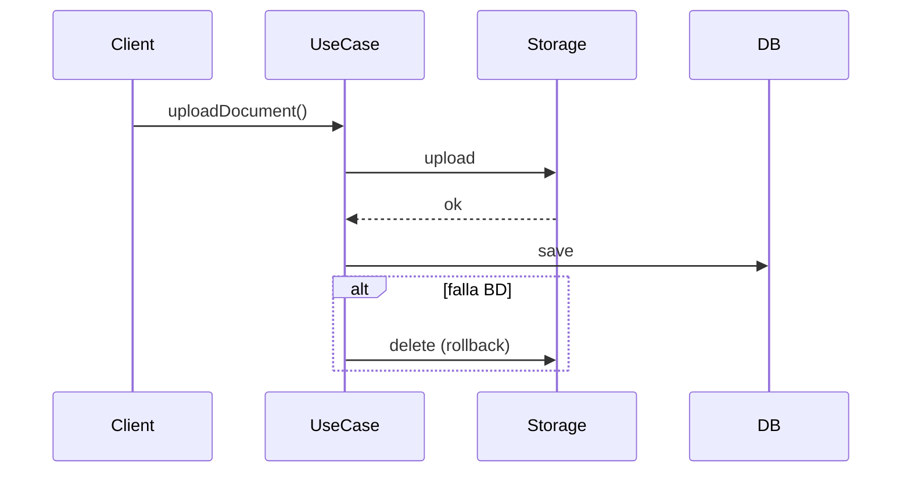
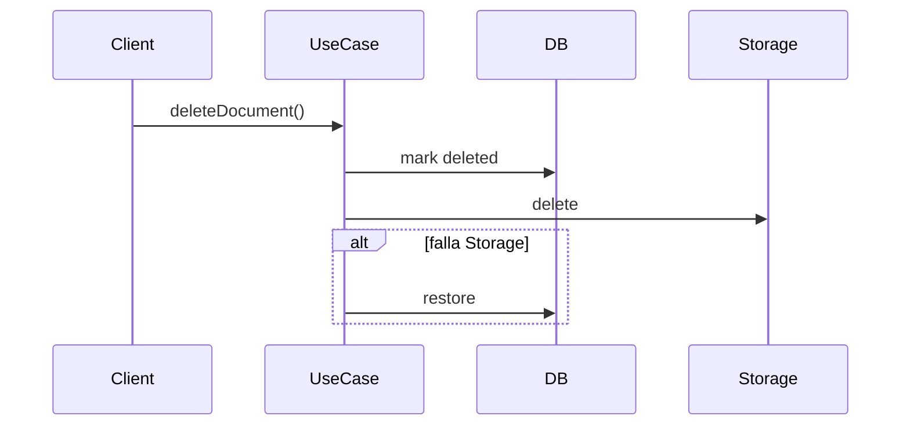
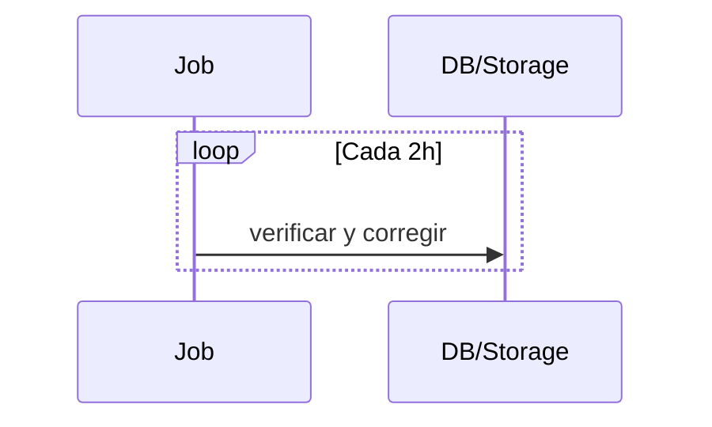

# Consistencia entre Storage y Base de Datos

## Descripción
Mecanismo para mantener la coherencia entre MinIO/S3 y la base de datos en `repository_documents`.

## Patrones

### 1. Subida (Rollback)
**Flujo:**
1. Subir archivo al storage
2. Guardar registro en base de datos  
3. Si falla BD → eliminar archivo y lanzar error



### 2. Borrado (Compensación)  
**Flujo:**
1. Marcar borrado en BD
2. Eliminar del storage
3. Si falla → restaurar BD



### 3. Reconciliación
**Job periódico:**
- BD sin archivo → marcar ERROR
- Archivo sin BD → eliminar



## Errores y Monitoreo
- Rollback y restauración automáticos
- Logs y métricas de inconsistencias  
- Procesamiento por lotes y asíncrono
```