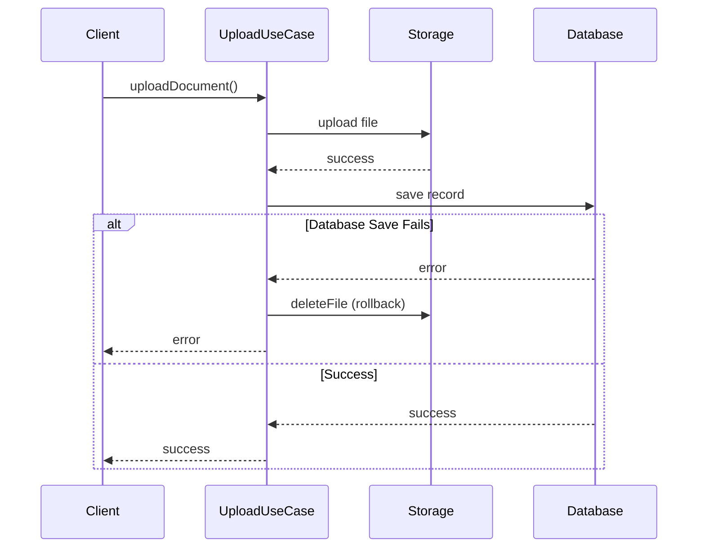
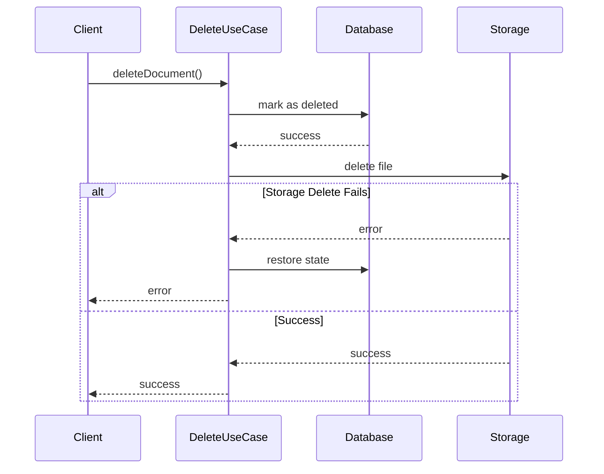
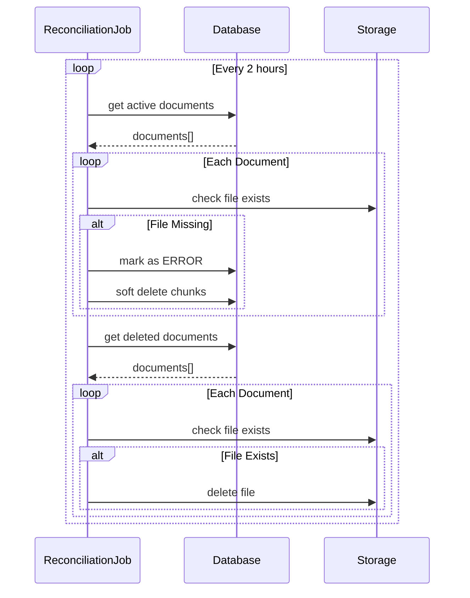

# Manejo de Consistencia entre Storage y Base de Datos

## Descripción
Este documento detalla el patrón de consistencia implementado para garantizar la coherencia entre el almacenamiento (MinIO/S3) y la base de datos en el módulo `repository_documents`.

## Patrones Implementados

### 1. Subida de Documentos (Upload)
Implementa un patrón de rollback para mantener la consistencia:

1. Subir archivo a storage (MinIO/S3)
2. Si es exitoso, guardar registro en base de datos
3. Si falla el guardado en BD:
   - Ejecutar rollback: eliminar archivo de storage
   - Propagar error al cliente

### 2. Borrado de Documentos (Delete)
Utiliza un patrón de compensación con restauración de estado:

1. Marcar como borrado en base de datos (documento y chunks)
2. Si es exitoso, borrar de storage
3. Si falla el borrado en storage:
   - Restaurar estado en base de datos
   - Restaurar chunks relacionados
   - Propagar error al cliente

### 3. Job de Reconciliación
Proceso periódico que verifica y corrige inconsistencias:

1. Chequea documentos activos en BD sin archivo en storage
   - Si falta archivo: marca documento como ERROR
   - Soft delete de chunks relacionados

2. Chequea archivos en storage de documentos borrados
   - Si existe archivo: elimina del storage
   - Registra en logs para auditoría

## Manejo de Errores

### En Subida
- Error en storage: No se intenta guardar en BD
- Error en BD: Rollback automático del storage
- Error en rollback: Se registra pero no impide la propagación del error original

### En Borrado
- Error en BD: No se intenta borrar de storage
- Error en storage: Restauración automática en BD
- Error en restauración: Se propaga como error crítico

### En Reconciliación
- Errores individuales: No detienen el proceso completo
- Cada operación tiene su propio manejo de errores
- Todos los errores son registrados para auditoría

## Monitoreo y Auditoría

- Logging detallado de operaciones críticas
- Registro de inconsistencias encontradas
- Tracking de operaciones de rollback y restauración
- Métricas de reconciliación periódica

## Consideraciones de Rendimiento

- Operaciones asíncronas cuando es posible
- Manejo eficiente de memoria en reconciliación
- Procesamiento por lotes en reconciliación
- Timeouts configurados para operaciones de storage